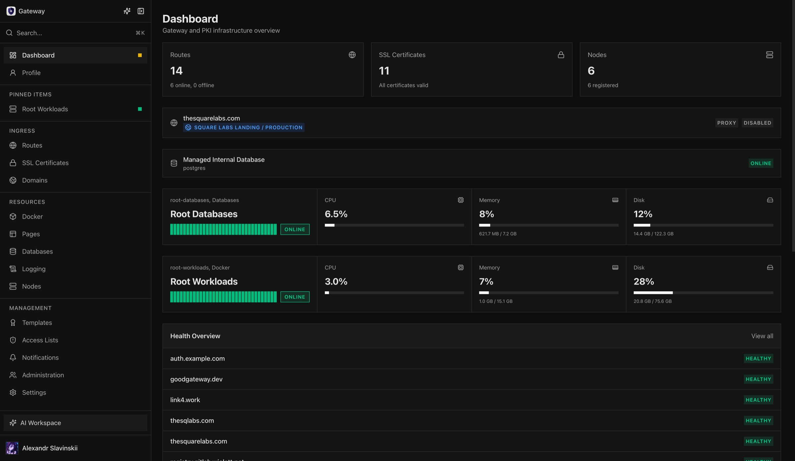
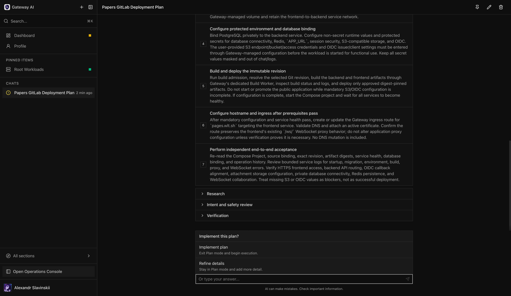
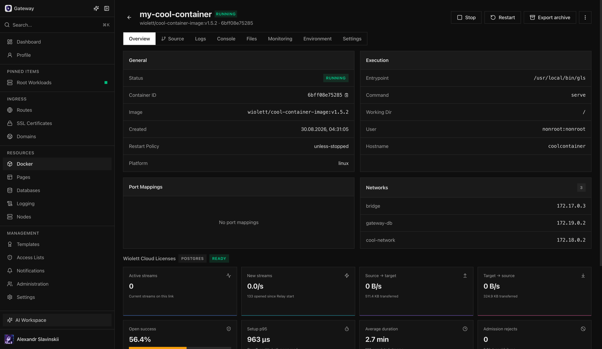
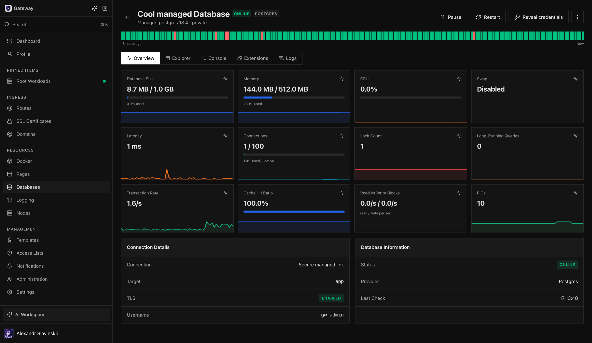
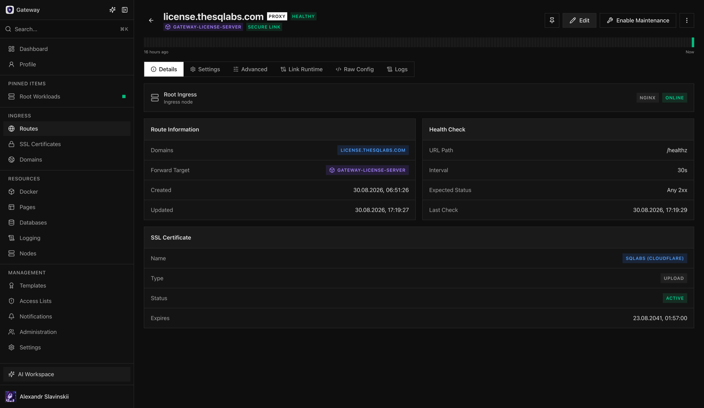
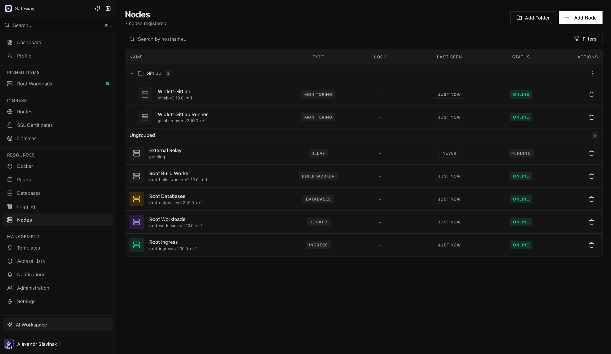

[English](README.md) | Русский | [中文](README.cn.md)

<p align="center">
  <picture>
    <source media="(prefers-color-scheme: dark)" srcset="docs/assets/brand/gateway-lockup-dark.png">
    <source media="(prefers-color-scheme: light)" srcset="docs/assets/brand/gateway-lockup-light.png">
    
  </picture>
</p>

# Gateway

AI-first, но не AI-dependent платформа управления инфраструктурой для nginx ingress, Docker-нагрузок, сертификатов, баз данных, логов, мониторинга, статус-страниц и автоматизации.

> [!NOTE]
> Основная разработка ведется на [GitHub](https://github.com/the-square-labs/gateway). Issues и запросы функций можно оставлять в [GitHub issue tracker](https://github.com/the-square-labs/gateway/issues).

## Зачем нужен Gateway

Gateway дает небольшим инфраструктурным командам один продукт для ежедневной работы, которая обычно разбросана между nginx-конфигами, shell-скриптами, Docker-хостами, папками с сертификатами, клиентами баз данных, дашбордами и alert-инструментами.

AI Workspace — рекомендуемый intent-driven интерфейс: начните с полноценного Scenario или опишите желаемый результат, просмотрите предложенный план и решите, выполнять ли его. Operations Console остаётся полноценным независимым интерфейсом для той же инфраструктуры, поэтому установка, эксплуатация, автоматизация и восстановление Gateway не зависят от AI.

Используйте Gateway, если хотите:

- Управлять несколькими proxy, Docker и monitoring узлами без открытия входящих management-портов на этих узлах.
- Дать операторам сфокусированный UI и API для production-задач без выдачи root shell access.
- Централизовать TLS, внутреннюю PKI, ACME-сертификаты, домены, статус-страницы, уведомления и audit history.
- Управлять Docker-контейнерами, deployments, portable и registry-backed `.gwca` archives, логами, файлами, консолями, secrets и registry workflows из одного места.
- Предоставить контролируемую автоматизацию через API tokens, OAuth, CI/CD webhooks и MCP clients.
- Начать с готового Scenario в AI Workspace или использовать Plan Mode, чтобы исследовать и проверить многошаговое изменение до явного подтверждения выполнения.

## Самая быстрая установка

Установите Gateway на Linux-сервер с Docker:

```bash
curl -sSL https://raw.githubusercontent.com/the-square-labs/gateway/main/scripts/install.sh | bash
```

> [!IMPORTANT]
> **Примечание для production-развертывания:** Gateway - привилегированная панель управления инфраструктурой. Для внутренних операций, таких как self-updates и локальное обслуживание, приложение Gateway монтирует Docker socket хоста. Запускайте Gateway в изолированной VM или на выделенном хосте и не размещайте на том же Docker-хосте посторонние workloads.

Installer запускает Gateway и выводит одноразовый код настройки. В браузерном мастере затем задаются канонический URL, выбираемые публичные и локальные network endpoints для nodes, один или несколько способов входа (OIDC, пароль или email-код), первый системный администратор, опциональное structured logging и опциональный AI Workspace. Gateway Inference настраивается внутри AI Workspace, а не как отдельный onboarding-продукт.

Откройте порты, подходящие для вашей схемы развертывания:

| Порт | Назначение |
|------|------------|
| `3000/tcp` | UI/API порт приложения Gateway. Для установок за NAT откройте его только в локальной сети и направьте внешний reverse proxy на него. |
| `443/tcp` | Опциональный публичный HTTPS endpoint вашего reverse proxy. Сам Gateway слушает `3000/tcp`. |
| `80/tcp` | HTTP и ACME HTTP-01 challenge, только если используется этот challenge mode. |
| `9443/tcp` | Публичный relay-backed gRPC endpoint для control и tunnel connections managed daemons. gRPC listener приложения Gateway остаётся внутренним. |

За NAT или существующим внешним reverse proxy публикуйте `3000/tcp` только в локальной сети и настройте внешний proxy на передачу публичного домена Gateway к выбранному HTTP- или HTTPS-транспорту на `<gateway-lan-ip>:3000`. Managed nodes все равно подключаются исходяще к Gateway на `9443/tcp`; входящие management-порты им не нужны.

При новой интерактивной установке единственный shell-вопрос — использовать ли native HTTPS или HTTP на порту `3000`. Вся настройка продукта выполняется в browser wizard; обновления неинтерактивны и сохраняют настройки.

Флаги, non-interactive installs, custom SSL, OIDC details, updates и node setup описаны в [installation guide](docs/installation.md).

## С чего начать

| Цель | Читать |
|------|--------|
| Понять, чем может управлять Gateway | [Capabilities](docs/capabilities.md) |
| Установить Gateway | [Installation guide](docs/installation.md) |
| Добавить nginx, Docker, database или monitoring узлы | [Nodes and daemons](docs/nodes.md) |
| Экспортировать или импортировать Docker-контейнеры со встроенным image или без него | [GWCA container archives](docs/docker-container-archives.md) |
| Настроить tokens, OAuth, MCP, logging, updates и AI | [Operations guide](docs/operations.md) |
| Настроить multi-provider inference proxy | [Inference proxy](docs/inference.md) |
| Изучить security model | [Security model](docs/security.md) |
| Понять license tiers и activation | [Licensing](docs/licensing.md) |
| Запустить проект локально или внести вклад | [Development guide](docs/development.md) |
| Посмотреть permission scopes | [SCOPES.md](SCOPES.md) |

## Обзор продукта

<table>
<tr>
<td align="center"><strong>Обзор инфраструктуры</strong></td>
<td align="center"><strong>Планирование в AI Workspace</strong></td>
</tr>
<tr>
<td></td>
<td></td>
</tr>
<tr>
<td align="center"><strong>Workload и Secure Link runtime</strong></td>
<td align="center"><strong>Наблюдаемость managed database</strong></td>
</tr>
<tr>
<td></td>
<td></td>
</tr>
<tr>
<td align="center"><strong>Ingress route и health</strong></td>
<td align="center"><strong>Распределённые ноды</strong></td>
</tr>
<tr>
<td></td>
<td></td>
</tr>
</table>

## Что покрывает Gateway

| Область | Кратко |
|---------|--------|
| Ingress | Домен выбирает публичную nginx ingress-ноду; route направляет трафик на адрес, Docker container, deployment или Pages Tag. Managed Additional Routes добавляют path-prefix targets внутри одного route, а Additional Secure Link Bindings дают advanced nginx config доступ к Docker upstreams. Также доступны maintenance mode, redirects, WebSockets, access lists, health checks, folders, templates, logs и stats. REST API сохраняет идентификаторы `proxy-host` для совместимости. |
| Pages | Проектный static-site hosting с неизменяемыми Deployments, изменяемыми Tags (включая управляемый системой `latest`), custom Routes, направленными на Tags, опциональными wildcard previews, runtime configuration без кэширования, per-project размещением и migration. Доступно в Personal и выше; Business+ добавляет Git source builds на изолированных Build Workers. Metadata источника/проекта, управление builds и publication доступны через AI Workspace и MCP, а remote MCP clients также могут загружать артефакты через authenticated resumable tool без передачи credentials в аргументах. |
| Docker | Container lifecycle, first-class single-node Compose Projects, доступный в Business+ прямой Git repository/branch push-to-deploy для containers, blue/green deployments и Compose projects, изолированные Build Workers, private-by-default внутренний registry под управлением Gateway во всех планах с опциональным внешним доступом в Business+, профиль runtime Default (`runc`) во всех планах и Secure (`runsc`/gVisor) в Business и Enterprise, Gateway-managed volumes, rollout/rollback, shared физические NVIDIA/AMD/Intel GPU, допустимые cross-node migrations контейнеров и volumes, offline inventory snapshots, registries, images, networks, tasks, webhooks, logs, console, file browser, secrets, env vars, ports и cleanup. Secure workloads не поддерживают GPU, migration и export; GPU-attached workloads в v1 также нельзя мигрировать или экспортировать. |
| Certificates | ACME SSL, uploaded certificates, internal root/intermediate CAs, certificate templates, CRLs, exports и привязка к routes. |
| Domains | Единый реестр hostnames, выбор nginx ingress-ноды, внешний или Cloudflare-managed DNS, validation, usage tracking и явная ingress migration. |
| Databases | Saved PostgreSQL, Redis и ClickHouse connections с encrypted credentials, health history, browsing, scoped query consoles и capability-aware write operations; private-by-default managed Postgres, Redis и ClickHouse instances могут безопасно подключаться к Docker workloads через Console, AI Workspace или MCP. |
| Monitoring | Node CPU, memory, disk, network, service status, capability-aware telemetry физических GPU, daemon runtime details, log streaming и update checks. |
| Logging | Опциональный ClickHouse-backed structured log ingestion со schemas, retention, ingest tokens, rate limits, search, storage caps и health safeguards. |
| Automation | API tokens, OAuth 2.0 PKCE, remote MCP endpoint со scoped-операциями для Ingress, Pages, Databases, Docker/Compose, source builds и Build Workers, чтением internal Gateway documentation, CI/CD webhooks, webhook notifications и status pages. |
| Integrations | GitLab workflows для projects, repositories, CI/CD, variables, webhooks, registry и sandbox; GitHub repositories и Actions; generic Git connectors; external SSH connectors; Cloudflare DNS/ACME automation. Credentials connectors шифруются, а доступ ограничен scopes. |
| Relay | Long-lived local relay владеет публичным `9443/tcp` для daemon control и managed tunnel traffic. Relay Pool добавляет remote supervisor/worker pairs, явное placement и rebalancing, drain и rolling signed updates, сохраняя один логический Secure Link. |
| AI Workspace | Опциональные intent-driven operations с готовыми Scenarios, Plan Mode, permission-aware tools, approvals, sandboxed execution, отслеживанием прогресса и финальной проверкой. До явного подтверждения планирование не выполняет изменений. |
| Inference | Опциональный multi-provider model gateway с отдельными tokens, usage controls, capability-compatible cross-provider fallback до начала output, OpenAI- и Anthropic-compatible API и управляемой настройкой Codex или Claude Code с опциональным user-session auto-start через `@sqgateway/inference`. |
| Administration | OIDC, password, email-code и passkey login, group-based и дополнительные per-user permissions, scoped programmatic access, audit logs, setup state, updates и license controls. |

## Как это работает

Gateway запускается как Docker stack на control-plane сервере. Managed hosts запускают небольшие Go daemons, которые подключаются к Gateway исходящим gRPC с mTLS.

```text
                Gateway server
        +-----------------------------+
        | app + relay + redis         |
        | postgres local or remote    |
        | clickhouse local/remote/off |
        | relay gRPC :9443            |
        +-------------+---------------+
                      |
                outbound mTLS
                      |
        +-------------+-------------------+
        |             |                   |
 nginx-daemon   docker-daemon     database profile     monitoring-daemon
 ingress route  container host    managed databases    metrics-only host
```

Relay — отдельный long-lived container и единственный публичный владелец `9443/tcp`. Обычные app-only обновления сохраняют relay container и установленные managed-database binding streams; обновление relay остается отдельным событием обслуживания data plane.

Локальный relay можно расширить до единого Relay Pool в **Settings > Relay**. Дополнительные relay-ноды подключаются через отдельный supervisor, исходяще соединяются с Gateway для управления и публикуют только настроенный data endpoint relay (по умолчанию TCP `9443`) для участвующих managed hosts. Gateway не меняет firewall, не выполняет NAT traversal и не создаёт overlay network. Добавление ноды само по себе не переносит трафик: это делает только явный Rebalance, после которого новые соединения распределяются по заранее проверенному активному набору relay workload-а, а пользователь по-прежнему видит один логический Secure Link.

Узлам не нужны входящие management-порты. Public traffic ports, например `80` и `443` на nginx nodes, все еще нужны для сервисов, которые вы публикуете.

## Security Model

Gateway по умолчанию ориентирован на безопасную работу как infrastructure control plane:

- Вход поддерживает OIDC, пароль, email-коды и passkeys. Local authentication требует проверенной SMTP-доставки, а group MFA policy применяется после primary credential.
- Managed nodes подключаются к Gateway исходяще по gRPC с mTLS. Первая регистрация требует одноразовый token и сгенерированный fingerprint gRPC-сертификата Gateway, а daemon проверяет TLS leaf Gateway перед отправкой token. После enrollment daemon-команды требуют client certificate, выпущенный внутренней node CA Gateway.
- Каждый node certificate привязан к node identity. Gateway проверяет mTLS certificate identity перед приемом control streams, log streams и certificate renewal requests.
- Узлам не нужны входящие management-порты. Потеря доступа к Gateway не останавливает существующие nginx configs или Docker containers; она только приостанавливает centralized control.
- API tokens, OAuth grants, MCP access, database credentials, certificate exports и secret reveal operations ограничены scopes, не превышают текущие permissions владельца и аудируются.
- Private key material и сохраненные infrastructure credentials шифруются at rest с настроенным `PKI_MASTER_KEY`.

Итог - PKI-backed trust model: short-lived enrollment tokens вводят узел в систему только после того, как daemon подтвердит, что говорит с pinned Gateway certificate, а долгосрочное доверие основано на certificate identity вместо reusable shared secrets. Это дает Gateway сильную базовую защиту от token interception во время setup и node hijacking после enrollment. Полное объяснение и hardening checklist см. в [security model](docs/security.md).

## Roadmap

Gateway уже ориентирован на production operations, а не на узкий MVP. Текущее направление - сделать его безопаснее, проще в эксплуатации и полезнее для малых и средних infrastructure fleets.

Готовая основа:

- [x] Multi-node nginx ingress management с domain affinity, routes и TLS deployment over outbound gRPC with mTLS.
- [x] Docker host management with deployments, webhooks, registries, logs, files, consoles, and secrets.
- [x] Monitoring daemon for host metrics, runtime state, and log streaming.
- [x] Internal PKI, ACME SSL, certificate templates, domain tracking, and expiry alerts.
- [x] PostgreSQL, Redis и ClickHouse database explorer с encrypted saved credentials, а также private-by-default managed Postgres, Redis и ClickHouse database nodes с secure application bindings.
- [x] Status pages, notifications, audit logs, RBAC, API tokens, OAuth PKCE, and remote MCP access.
- [x] Управляемый в настройках Gateway экспорт audit events в SIEM с зашифрованной аутентификацией bearer, HMAC-SHA256 или custom header.
- [x] Опциональный ClickHouse-backed structured logging и опциональный AI Workspace.
- [x] AI Workspace Scenarios и Plan Mode с проверенными планами, явным подтверждением выполнения, управлением прогрессом и финальной проверкой.
- [x] Опциональный multi-provider inference gateway с OpenAI-compatible и harness-specific APIs.
- [x] View-based, resource-scoped permission model with filtered list visibility.
- [x] Hardened OIDC/OAuth flows, setup lockout, fail-closed public endpoints, and signed update trust.
- [x] Gateway and daemon update workflows with signature-verified artifacts.
- [x] Settings workspace organized around preferences, gateway configuration, and feature controls.
- [x] Docker-to-nginx Secure Links.
- [x] First-class Compose Projects на одной Docker-ноде: discovery, inventory, monitoring и logs внешних проектов в Community; deployment и lifecycle management с Personal и выше, включая immutable revisions, adoption, folders, drift и защиту дочерних ресурсов.
- [x] Git push-to-deploy для Business+ с изолированными Build Workers, immutable artifacts во внутреннем registry, vulnerability policy и опциональным внешним доступом к registry.

Планируемая работа:

- [ ] Storage connections для S3, R2, MinIO, FTP, FTPS, SFTP и SMB.
- [ ] Managed storages с Secure Links и backup/restore управляемых баз после Storage foundation.
- [ ] Vulnerability and security scanning для Business и Enterprise.
- [ ] Горизонтальное масштабирование приложений для Business и Enterprise: объединение нескольких Docker nodes в кластер и deployment приложения на этот кластер. **In development.**
- [ ] Вертикальное масштабирование workloads для Business и Enterprise: несколько managed instances одного workload на одной машине. **In development.**
- [ ] Bastion and SSH management daemon for controlled host access.
- [ ] CLI for scriptable programmatic control from terminals and CI/CD jobs.
- [ ] Plugin system for extending Gateway with new integrations and operational modules.
- [ ] Broader operational documentation and examples for common deployment patterns.

## FAQ

<details>
<summary><strong>Gateway заменяет Kubernetes?</strong></summary>

Нет. Gateway предназначен для прямых инфраструктурных операций: nginx hosts, Docker hosts, certificates, domains, databases, logs, monitoring и automation. Он может использоваться рядом с Kubernetes, но не пытается быть Kubernetes control plane.
</details>

<details>
<summary><strong>Узлам нужны входящие management-порты?</strong></summary>

Нет. Daemons подключаются к Gateway исходящим gRPC с mTLS. Nginx nodes все еще нужны обычные public traffic ports, такие как `80` и `443`, если они обслуживают публичные сайты.
</details>

<details>
<summary><strong>Может ли Gateway управлять существующим nginx host?</strong></summary>

Да. Установите nginx daemon в режиме `integrate`. Gateway сохранит ваш существующий `nginx.conf` и добавит managed includes плюс локальный stats endpoint. См. [nginx node modes](docs/nodes.md#nginx-node-modes).
</details>

<details>
<summary><strong>Может ли Gateway работать без ClickHouse?</strong></summary>

Да. Выберите **Disabled** для structured logging в first-run wizard или **Settings > Advanced**. Остальная часть Gateway продолжает работать; managed local ClickHouse можно отключить без удаления data volume.
</details>

<details>
<summary><strong>Могут ли API или OAuth tokens раскрывать secrets?</strong></summary>

Только если владелец уже имеет нужные scopes. Sensitive OAuth scopes требуют явного opt-in во время consent, API/OAuth tokens не могут превышать текущие effective permissions пользователя, а resource-scoped write-capable scopes остаются ограничены тем же resource, когда они подразумевают read/view checks. См. [SCOPES.md](SCOPES.md).
</details>

<details>
<summary><strong>Как Gateway предотвращает hijacking managed nodes?</strong></summary>

Gateway использует собственную internal PKI для daemon identity. Команда setup узла содержит one-time enrollment token и fingerprint gRPC-сертификата Gateway. Daemon проверяет представленный Gateway TLS leaf certificate перед отправкой token, получает mTLS client certificate от node CA Gateway, удаляет token из локального config и переподключается с certificate. Gateway затем проверяет certificate identity на control streams, log streams и renewal requests. См. [security model](docs/security.md).
</details>

<details>
<summary><strong>Что произойдет, если Gateway offline?</strong></summary>

Managed services продолжают работать. Existing nginx configs продолжают обслуживать traffic, Docker containers продолжают работать, а daemons переподключаются, когда Gateway возвращается. Centralized UI/API control недоступен до восстановления приложения.
</details>

<details>
<summary><strong>AI Workspace обязателен?</strong></summary>

Нет. AI Workspace опционален. Operations Console, REST API, OAuth и MCP работают независимо, а Gateway не отправляет данные AI provider, пока администратор не включит AI Workspace и не настроит provider. Оператор может начать с готового Scenario или выбрать Plan Mode для подготовки проверенного и понятного плана; до явного подтверждения реализации никаких изменений не выполняется.
</details>

## Планы и лицензирование

У Gateway четыре продуктовых плана. Платные планы применяются к одной установке Gateway без отдельной оплаты за managed nodes, пользователей или custom permission groups.

Community предназначен только для некоммерческого использования по [PolyForm Strict License 1.0.0](LICENSE.md). Ключ Personal, Business или Enterprise, выданный Square Labs, автоматически даёт указанному в лицензии владельцу ограниченное право коммерческого использования одной официальной немодифицированной установки по [Commercial Key License](COMMERCIAL-LICENSE.md), включая 30 календарных дней после истечения ключа. Ни одна из лицензий не разрешает модификацию или распространение.

> [!NOTE]
> Цены предварительные, не являются офертой и могут измениться. Перед покупкой уточните актуальные цены и условия.

| План | Месяц | Год | Масштаб и назначение |
|------|-------|-----|----------------------|
| <br>Community | $0 | $0 | Некоммерческое использование ядра платформы, AI Workspace и Gateway Inference; до 100 managed nodes, 10 пользователей и 5 custom permission groups; read-only discovery, inventory, monitoring и logs Compose-проектов. Pages недоступны. |
| <br>Personal | $29 | $290 | Право коммерческого использования, неограниченные plan quotas для managed nodes/users/groups, deployment и lifecycle management Compose-проектов, import/export архивов контейнеров, blue/green deployments, cross-node migration, managed databases, публичные status pages, Pages static-site hosting и registry discovery. Находящиеся в разработке application-cluster функции сюда не входят. |
| <br>Business | $189 | $1,890 | Возможности Personal (включая Compose management и Pages), а также Git push-to-deploy для containers, blue/green deployments, Compose Projects и Pages с изолированными Build Workers и build vulnerability policy, опциональный внешний доступ к private internal registry, Docker Secure Runtime, structured logging, audit export, guided onboarding, security scanning после выпуска и находящиеся в разработке application clusters и same-node multi-instance. |
| <br>Enterprise | По запросу | По запросу | Возможности Business (включая Pages), а также Internal PKI, SIEM export, выделенный технический контакт и сопровождение развёртывания и миграции. |

Полная матрица возможностей, статусы доступности, проверка лицензии и граница source license приведены в [Планах и лицензировании](docs/licensing.md).

После истечения платного ключа технические entitlements продолжают действовать 24 часа для Personal, 3 дня для Business или 7 дней для Enterprise. Этот продуктовый grace period не связан ни с offline validation, ни с 30-дневным правом коммерческого использования, описанным выше.

Copyright (c) 2021-2026 [Square Labs](https://thesquarelabs.com)
